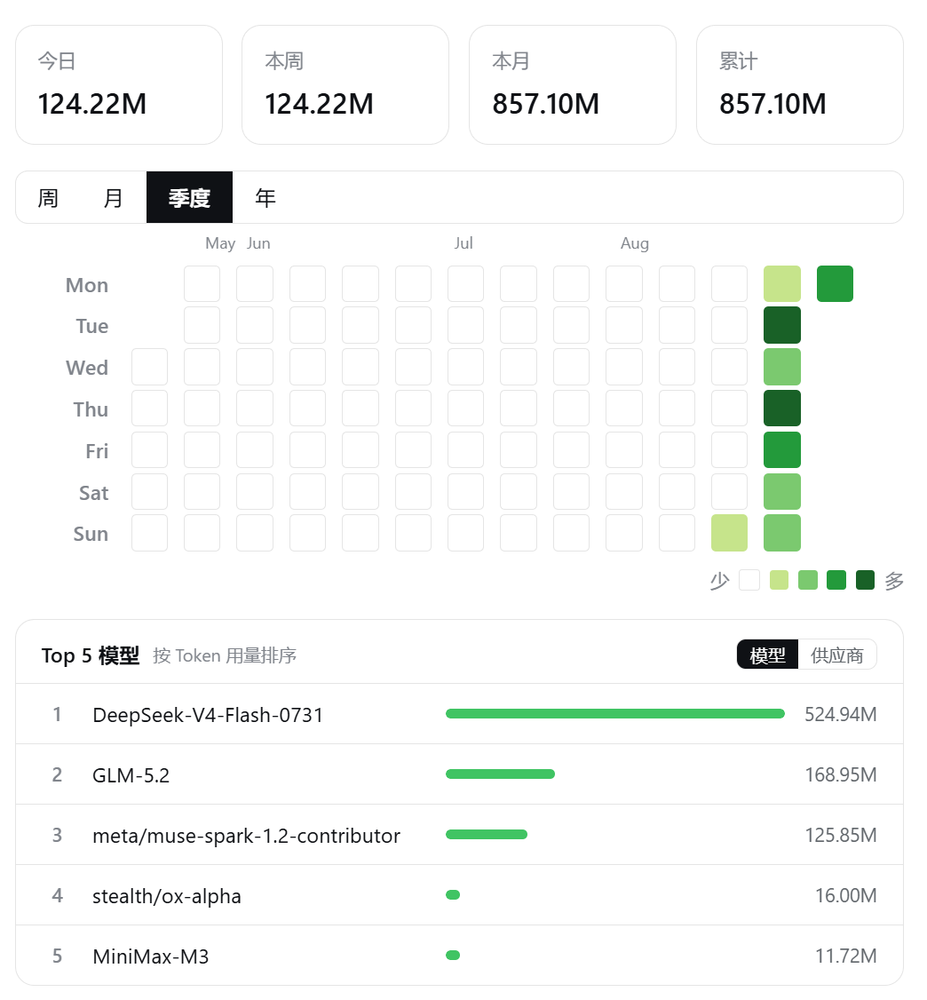
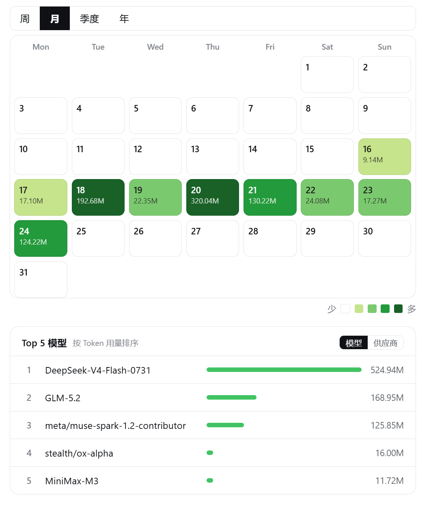
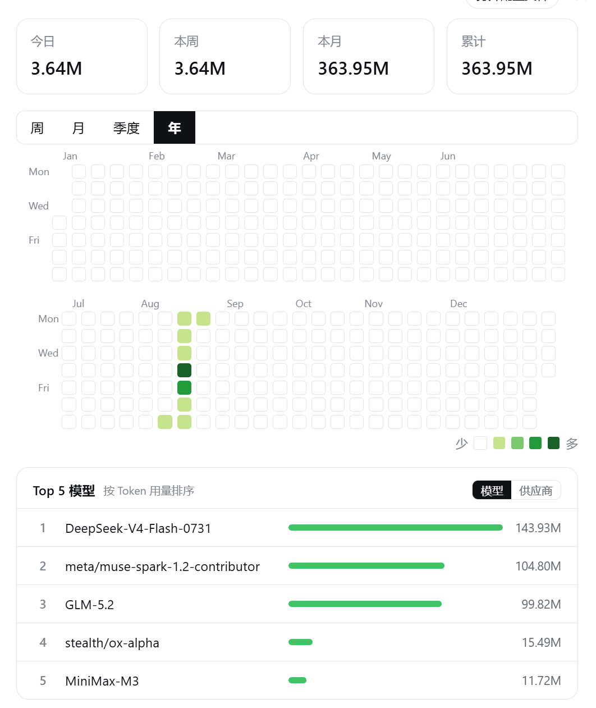

# dsh-token-heatmap（中文版）

> English version: see [README.en.md](./README.en.md)
> 完整版本：[README.md](./README.md)

DSH Web 设置内独立栏的本地 Token 热图插件，GitHub 风格日历视图。

- **零网络、零计费**：仅读取本地 `~/.dsh/sessions/**/session.jsonl.zstd`
- **持久化**：首次同步写入 `~/.dsh/storages/dsh-token-heatmap/`，删会话不丢历史
- **视图**：周（按小时展开）/ 月（铺满日历）/ 季度（近 90 天 GitHub 式）/ 年（整年双行）
- **统计**：今日 / 本周 / 本月 / 累计
- **Top5**：按模型 + 供应商双 Tab，按视图窗口动态计算；点击日期格可展示当日 Top5

## 安装

```bash
# 1. 从 GitHub 安装插件
dsh plugin --profile web add github:Hou-DL/dsh-token-heatmap
# 若之前装过 file: 本地版本，先移除再装：
# dsh plugin --profile web remove dsh-token-heatmap

# 2. 重启 dsh web
pkill -f "dsh web"
sleep 2
nohup dsh web > /tmp/dsh-web.log 2>&1 &

# 3. 打开 http://127.0.0.1:3080 → 设置 → Token Heatmap
```

## 效果一览

| 模块 | 效果 |
| --- | --- |
| **统计卡片** | 当 / 周 / 月 / 总 四个数值，单行展示，两位小数 + M/k 缩写 |
| **语言切换** | 中 / 英文，刷新时间线与视图也跟随 |
| **视图切换**（周 / 月 / 季度 / 年） | 25% / 50% / 75% / 100% 四档绿，自适应每视图 |
| **周视图** | 行号固定周几 + 24 小时柱，按时看用量高峰 |
| **月视图** | 7×5/6 日历格，格内显示日期与当日总用量 |
| **季度视图** | 近 90 天 GitHub 风格，间距与方格都放大便于看清趋势 |
| **年度视图** | 整年 53 周双行排布，下方月份头、上方周列小方块 |
| **翻页** | 周 / 月视图有 ‹上一周 / 下一周› 控件（英文同步） |
| **Top5 切换** | 模型 ↔ 供应商 Tab；切换「视图」时重算；点击日期格后展示当日 Top5 |
| **刷新** | 「刷新」按钮 + 自动刷新（5/10/30/60 分钟 / 关闭） |
| **更多** | 右上角 ⋯ 菜单里有「重置历史」 |

详见 [README.md](./README.md)。


## 截图






